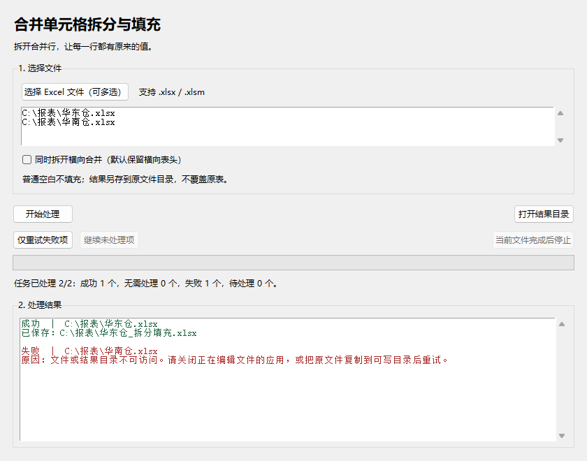

入口判断：/acceptance · v1.1 本地候选验收

> **历史记录：当前状态请看 [大文件与最终候选验收](large-data-acceptance-2026-10-09/report.md)。** 下方是逐行改造前的身份、失败与待补证记录，不是当前候选结论。新 ZIP 为 `07b80151…`，95+9 回归、真实 190,566 行日明细、新 EXE 6×2 业务处理与全量核验已通过。

> **最新深验更正：** 当前正式发布暂缓。用户反馈约 5 万行日明细，现有 Top50 ×31 负载不具代表性；50,250 行同结构压力补测达到探针 3 GiB 限额被主动终止，不能算处理成功或应用 OOM。已完成的保真修复、候选构建测试失败定位及后续状态见 [深度验收](release-acceptance-2026-10-09/report.md)。以下均为历史验收身份，不证明本轮待构建包已通过。

> **2026-10-09 当前结果：** 已完成用户提供的 5 本业务文件 × 两种模式验收，并修复工作表范围声明问题、重建候选。当前 ZIP SHA256 为 `92870bdc52451341c7268f6e1937a3741ecd3e1012de0cf2e4026c606ccdd4a9`。新 EXE 内容校验与实际 Excel `16.0.17932.21000` 读取均通过；完整回归为 43 + 9 项。以 [实际业务验收报告](business-acceptance-2026-10-09/report.md) 为当前候选事实源。下文保留 **2026-10-08 历史候选** 身份和结果，不能将旧包哈希用于当前包。WPS、干净机与人工视觉检查仍待补证。

交付模式：Vibe Coding 全流程型。**结论：本轮开发及本地候选验收通过。** 本地便携包可交付；Windows 10/干净机和实际 Excel/WPS 客户端仍待补证，不能据此声称所有正式环境均已验收。远端发布暂不执行。

# 对象与证据身份

- 验收版本：v1.1；源分支 `main`；基线 HEAD `470a4e1b3c5346ed8bdfd3d770b4d235eb45f173` **加本轮未提交改动**，不能把旧 HEAD 单独作为新包源码身份。
- 等价构建身份：冻结的两个业务脚本和四个测试文件，以 [source-snapshot-hashes.json](evidence/source-snapshot-hashes.json) 逐项 SHA256 锁定；本轮测试、构建使用同一快照。
- 引擎 SHA256：`f7a77d0d4dc651a792de27e3f9d8e2d5e29f0112b66b14641dbdba42241474a4`。
- GUI SHA256：`0d59d53e067da326984702ece5939347448a829012b564363eb9469c42b25f87`。
- 候选 ZIP：`E:\codex\excel-tools\dist\ExcelTools-v1.1-Windows-x64.zip`，12,161,714 字节。
- ZIP SHA256：`4a0ca98b0f95d172c35a12219e2582ee95fab39dec771e74a11ea75c2c97927c`。
- 包内 EXE SHA256：`dc7ec7e07092533f67d25a6172995475d432a0ccf76dc351c8b89e6c8b72f9b5`。
- [最终一致性检查](evidence/final-integrity.json)：当前六个源码/测试文件与快照哈希一致；ZIP 仅含 EXE 和说明，EXE 与隔离自检二进制一致；说明字节与源文件转 UTF-8 BOM 后精确一致。
- 环境：Windows 11，本机 Python 3.12.8；隔离环境安装 PyInstaller **6.22.3**、openpyxl **3.1.5**，与 CI 固定依赖一致。
- 验收日期：2026-10-08（Asia/Shanghai）；清单时间戳 `2026-10-08T15:53:55.2234923Z`。未运行远端 CI，也未下载或替换官方 Release。

| 组合证据闭包 | 状态与来源 |
|---|---|
| 候选路径、版本、哈希 | 已提供：[verification-manifest.json](evidence/verification-manifest.json) |
| source commit 或等价构建身份 | 已提供：上述基线加冻结文件哈希，明确存在未提交实现 |
| review 对象/范围/时间 | 已提供：2026-10-08 对本轮引擎与 GUI 增量审查；发现的局部 namespace 与窄窗裁切已修复并纳入测试 |
| 日志或测试时间/环境 | 已提供：同一冻结脚本执行的测试、构建与隔离自检日志；工具版本记录在 manifest |

## 本轮实际结果

| 合同 | 预期 | 实际结果与证据 | 结论 |
|---|---|---|---|
| F-01 | 文本 CR、属性 CR/LF/TAB、局部 namespace、CDATA 和非目标内容保持语义 | 引擎回归与独立验收均通过；局部声明和前缀重绑定四个子场景已覆盖；非目标 ZIP 部件与无关公式保持一致。[仓库测试](evidence/unit-tests.txt)、[独立验收](evidence/independent-acceptance.txt) | 通过 |
| F-02 | 不支持富值锚点明确拒绝，无输出、源文件不变；非目标不误拒绝 | vm/cm/extLst 锚点与隐藏目标元数据均拒绝；未选中表/区域保留；源 SHA、目录前后对照通过。 | 通过 |
| F-03 | 减少全行搬移与空格枚举，保留值、属性、顺序和冲突拒绝 | 同输入基准见下表；4 万行全量值/属性/顺序检查通过。性能样本不是业务 SLA。 | 通过 |
| F-04 | 中文操作建议与技术详情，避免单一错误归因 | 损坏 ZIP、模拟加密标志、权限错误等分支均通过；实际 Office 密码加密文件未验证，不混同合成拒绝场景。 | 通过（已定义错误路径） |
| F-05/F-06 | 仅失败重试、仅未处理继续、当前文件安全完成后停止、选项一致 | 真实 Tk 两次暂停→恢复→失败修复重试→继续剩余；成功项未重跑，日志与输出目录保留；关闭、防重入及窄窗长状态回归通过。 | 通过 |
| F-07 源码 | 全量回归、版本与诊断可追溯 | **40 项仓库测试，2.479 秒；9 项独立验收，0.952 秒，全部通过**。无 stderr 自检异常日志通过；源码自检成功。 | 通过 |
| F-07 便携包 | 使用同源快照构建，独立 EXE 隔离自检 | PyInstaller 6.22.3 构建成功；仅 EXE 的中文空格目录、不同工作目录、清理 Python/Tcl 环境、受限 PATH、中文解压目录，退出 **0**。[构建日志](evidence/build.txt)、[进程结果](evidence/portable-process.txt)、[自检日志](evidence/portable-self-test.txt) | 通过（本机 Windows 11） |

### 性能观察

| 相同输入场景 | v1.0 基线 | v1.1 候选 |
|---|---:|---:|
| 稀疏矩形 300 行 × 300 列 | 25.75 ms | 7.59 ms |
| 稀疏矩形 600 行 × 300 列 | 46.73 ms | 19.64 ms |
| 密集纵向 300 组合并 | 20.30 ms | 21.55 ms |
| 密集纵向 600 组合并 | 49.19 ms | 46.33 ms |

候选单合并块、4 万行全量校验样本耗时 1.063 秒。以上均是本机单次观察；稀疏场景改善明显，密集场景接近，不宣称所有工作簿都获得相同比例提速。原始数字位于独立验收日志的 `BENCHMARK_JSON`。

## UI 表达物与证据边界

真实 Tk 默认 840×660、最小 680×540 窗口截图均已查看；长状态随宽度变化的断言覆盖 840→680→840。截图是向真实界面填入合成显示状态后的布局证据，不替代上表中实际线程和文件操作测试。

[最小窗口截图](evidence/ui-minimum.png) · [截图脚本](evidence/capture_ui.py)

## 证据继承与未关闭边界

v1.0.0 的引擎、GUI 和包体验证因源码/候选变化已失效；本轮相关功能全部新测。上一轮性能数据仅作为历史取证，不替代本轮同输入对比。对原有不覆盖文件、公式拒绝、隐藏内容保护、类型和横向合并规则，通过重跑既有用例确认。

| 未关闭缺口 | 最小补证动作 | 所需证据 | 通过标准 |
|---|---|---|---|
| 干净目标 Windows 环境 | 按 [MV-01](manual_verification_v1.1.md) 用同哈希包运行 | 系统/包身份、启动截图和输出核验 | 符合 PRD F-07 的免安装及原文件保护语义 |
| 真实 Excel/WPS 显示与实际文件形态 | 按 MV-02 打开脱敏副本/输出 | 客户端版本、无修复提示及内容对照 | 符合 F-01/F-02 和已有处理范围；不把字节保留当作宏执行或客户端显示验收 |
| 真实使用场景的恢复体验 | 按 MV-03 操作与记录 | 操作步骤、状态、输出对应关系 | 符合 F-05/F-06；本轮合成数据真实执行证据继续有效 |

这些边界不是本轮发现的新失败，也未被伪装成通过。工作表选择、省略坐标兼容、富值复制属于 PRD 明确延后项。

## 交付与发布判断

- 源码实现和本地便携候选：可交付，包含本轮通过的范围与上述环境限制。
- 安装器/商店包：不适用，本项目没有该交付面。
- 正式使用环境全面验收：待补证，不能扩大本机结论。
- 本地提交、远端 push、tag、Release、附件上传、可见性变更：**暂不执行，未获得对应授权**。
- 回退：无数据迁移；保留原文件和旧版程序，出现异常先停用受影响候选。回退至 v1.0.0 不消除其已记录保真缺陷。

## 工具与可复核材料

实际使用 PowerShell/Python、unittest、独立合成脚本、Tk、Win32 PrintWindow、ZipFile、SHA256、PyInstaller。没有读取 `testfile/` 业务文件。

复核入口：[独立验收脚本](evidence/independent_acceptance.py)、[构建验收脚本](evidence/run_acceptance.ps1)、[源码快照哈希](evidence/source-snapshot-hashes.json)、[依赖安装记录](evidence/dependency-install.txt)。脚本保留本轮临时路径，重放前需配置新的隔离目录；不要覆盖旧证据。

Memory（auto）：本轮正式状态与候选身份已写入 `Excel Tools project state` 并回读确认；长期记忆仅作导航，以仓库及候选实物为事实源。
