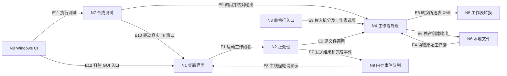

入口判断：/review

交付模式：团队协作型（team_pm）。主通路：project；辅助通路：implementation。以下是评审发现与候选建议，尚未进入 PRD 或实施。

# Excel Tools 深度评审 · 2026-10-08

## 判断与对象

项目已经具备一个小型桌面工具所需的清晰主流程和基本保护。当前最值得投入的是**输出数据保真、较大工作表的处理效率、失败后的恢复体验**。先修复 R-001、R-002，再处理 R-003，比扩充工具种类或重做界面更有价值。

- Review ID：REV-20261008-01；状态：评审完成，缺陷未修复。
- 对象：`E:\codex\excel-tools` 当前工作区；分支 `main`；HEAD `470a4e1b3c5346ed8bdfd3d770b4d235eb45f173`；本地标签 `v1.0.0` 指向同一提交。
- 评审开始时受版本控制的文件无改动，已有未跟踪 `testfile/`；仅查看该目录文件名和大小，未解压或读取业务内容。评审交付新增于 `docs/reviews/`，业务源码未修改。
- 事实来源：两个入口脚本、三个测试文件、README、使用说明、开发说明、Windows 构建工作流、打包说明、本轮合成复现及本地构建。
- 本轮深度维度：数据保真、异常恢复、操作体验、验证与发布、维护成本。
- 边界：没有核验远端 Release、没有在 Excel/WPS 中人工打开输出，没有完成 Windows 10 或干净虚拟机验收；没有真实业务数据分布、用户访谈或使用频率。因此不宣称发布验收通过，也不编造收益和性能门禁。

## 产品与运转脉络

**事实**：产品面向 Windows 10/11 的 64 位电脑，免安装、本地处理 `.xlsx/.xlsm`，核心任务是把合并区域的原值填入拆分后的行。[README](/E:/codex/excel-tools/README.md:3)

**推断**：主要使用者是清洗导出报表的办公人员；其关键成功标准是能找到结果、理解失败原因，并信任输出数据。实际人群和使用频率尚未验证。

核心路径是“选择文件 → 选择是否拆横向 → 串行处理各文件 → 输出成功/无需处理/失败 → 打开结果目录”。GUI 默认包含隐藏表；CLI 另有指定工作表入口。核心数据由 ZIP 中的工作表 XML 读取，修改的表重新序列化，其他包部件逐项复制。运行状态和结果保存在内存，输出落到原文件目录。

图中仅包含已从代码确认的关系；没有云服务、数据库或登录权限子系统。

| 节点 | 职责及独立定位 |
|---|---|
| N1 | 窗口、文件选择、结果展示：[Application](/E:/codex/excel-tools/excel_unmerge_gui.py:63) |
| N2 | 串行处理、隔离单文件异常：[process_batch](/E:/codex/excel-tools/excel_unmerge_gui.py:50) |
| N3 | 参数解析及退出状态：[main](/E:/codex/excel-tools/excel_unmerge_fill.py:274) |
| N4 | 校验、筛选工作表及输出：[process_file](/E:/codex/excel-tools/excel_unmerge_fill.py:195) |
| N5 | 拆分、填充、排序、序列化：[transform_sheet](/E:/codex/excel-tools/excel_unmerge_fill.py:68) |
| N6 | 原文件及同目录另存文件：[路径与 ZIP 读写](/E:/codex/excel-tools/excel_unmerge_fill.py:197) |
| N7 | 转换及窗口测试：[转换测试](/E:/codex/excel-tools/tests/test_excel_unmerge.py:62)、[窗口测试](/E:/codex/excel-tools/tests/test_windows_gui_helpers.py:14) |
| N8 | 测试、构建、隔离自检及产物上传：[工作流](/E:/codex/excel-tools/.github/workflows/windows-build.yml:11) |
| N9 | 主线程与工作线程之间的队列：[队列创建](/E:/codex/excel-tools/excel_unmerge_gui.py:70) |

| 边 | 独立代码依据 |
|---|---|
| E1 | [创建并启动线程](/E:/codex/excel-tools/excel_unmerge_gui.py:156) |
| E2 | [批处理中调用 process_file](/E:/codex/excel-tools/excel_unmerge_gui.py:55) |
| E3 | [CLI 传递选项](/E:/codex/excel-tools/excel_unmerge_fill.py:292) |
| E4 | [以 ZIP 读取原文件](/E:/codex/excel-tools/excel_unmerge_fill.py:202) |
| E5 | [逐工作表调用转换](/E:/codex/excel-tools/excel_unmerge_fill.py:215) |
| E6 | [xb 独占创建及写包](/E:/codex/excel-tools/excel_unmerge_fill.py:229) |
| E7 | [result 和 done 入队](/E:/codex/excel-tools/excel_unmerge_gui.py:56) |
| E8 | [非阻塞取队列并显示](/E:/codex/excel-tools/excel_unmerge_gui.py:161) |
| E9 | [转换后独立读取并核对源文件](/E:/codex/excel-tools/tests/test_excel_unmerge.py:75) |
| E10 | [驱动 start 及 Tk 事件循环](/E:/codex/excel-tools/tests/test_windows_gui_helpers.py:47) |
| E11 | [unittest discover](/E:/codex/excel-tools/.github/workflows/windows-build.yml:23) |
| E12 | [PyInstaller GUI 打包入口](/E:/codex/excel-tools/.github/workflows/windows-build.yml:25) |

## 主发现表

严重度说明：Major 表示显著影响结果可信度或核心使用；Minor 表示有限兼容/诊断影响。严重度不等于已批准排期。未发现可据此认定的全项目 Blocker。

| ID | 现象、影响与根因 | 严重度 / 状态及证据 | 最小调整与验证 | 去向 |
|---|---|---|---|---|
| R-001 | **处理一个合并块，会改变同表其他内容。** 合法 XML 字符引用表示的回车被变成换行；数据验证提示里的换行被变成空格。根因是整表经过 DOM 后重新序列化时，未保持这些字符的语义。普通业务单元格不属于拆分目标也会受影响。 | **Major / 已确认。** [序列化位置](/E:/codex/excel-tools/excel_unmerge_fill.py:164)。只合并 A1:A2，B1 原值 `first\rsecond` 输出为 `first\nsecond`；提示原值 `one\ntwo` 输出为 `one two`。[复现结果](/E:/codex/excel-tools/docs/reviews/2026-10-08-evidence/probes.json)；另用 openpyxl 3.1.5 独立读取核对。 | 研发保证被修改表中非目标内容的语义不变；测试纳入文本回车、属性换行/制表符、普通单元格及数据验证。修复不能仅检查 XML 可解析或 ZIP 可打开。 | Bugfix，优先 |
| R-002 | **合并锚点为“单元格内图片”时，新行显示值的关联不完整。** 填充仅复制 `s/t` 与 `v/is`，遗漏 `vm` 值元数据关联，新增格成为裸 `#VALUE!`。原锚点、图片文件、richData 部件仍保留，不能描述为“所有图片丢失”。 | **Major / 已确认包内关联丢失；Excel 365 界面待验证。** [复制属性和内容](/E:/codex/excel-tools/excel_unmerge_fill.py:120)。XlsxWriter 3.2.5 生成真实图片工作簿；输入 A1 有 `vm="1"`，输出 A2 无 vm，程序报告成功并填充 1 格。[取证 JSON](/E:/codex/excel-tools/docs/reviews/2026-10-08-evidence/engine-fidelity.json)。 | 先明确此类值的支持边界；最低可接受行为是识别并明确拒绝不支持的锚点，且无输出。若要支持，再核验新增值与图片关联及 Excel 实际显示。不要将字节复制等同于值语义保真。 | Bugfix / 支持边界治理，优先 |
| R-003 | **小范围转换也承担全表重排成本，大矩形还会扫描全部空位置。** 即使只有 A1:A2 一个合并块，所有行仍逐个移除再追加；冲突检查按矩形面积遍历。随表规模增长，等待会放大。 | **Major / 已确认机制与本机样本；实际用户频率待确认。** [全部行重排](/E:/codex/excel-tools/excel_unmerge_fill.py:151)、[全网格检查](/E:/codex/excel-tools/excel_unmerge_fill.py:97)。单块、1/2/4 万行耗时约 0.31/0.95/3.24 秒；4 万行无合并约 0.54 秒。[样本与 profile](/E:/codex/excel-tools/docs/reviews/2026-10-08-evidence/probes.json)。另 200 行、1 个实体单元格，A1:A200 约 0.006 秒，A1:XFD200 约 0.825 秒（终端单次复现）。 | 研发减少与改动无关的全表搬移和空坐标枚举。用相同合成输入比较前后性能，同时保留顺序、隐藏内容拒绝及其他单元格不变的断言。未设真实业务 SLA，数字不能作为发布门槛。 | 性能治理，随后 |
| R-004 | **常见失败缺少用户可执行的解释。** 损坏 `.xlsx` 在结果中只显示 `File is not a zip file`，用户不能据此判断如何恢复。 | **Minor / 已确认。** [原异常入队](/E:/codex/excel-tools/excel_unmerge_gui.py:59)、[直接展示](/E:/codex/excel-tools/excel_unmerge_gui.py:184)。真实透明 Tk 窗口与损坏合成文件复现；没有模拟真实加密工作簿。 | 常见错误增加中文原因范围和下一步，保留可复制技术详情。对 `BadZipFile` 不武断归因为损坏，应涵盖不支持的文件形态。验证建议对目标用户是否可操作。 | 体验修整 |
| R-005 | **某些省略显式坐标的文件无法处理。** 合成省略 row/@r 或 cell/@r 的输入，独立读取器可读取 A1，而本程序分别报空字符串转整数或无效坐标。 | **Minor / 已确认这两种样本行为；来源普遍性待确认。** [行和单元格索引](/E:/codex/excel-tools/excel_unmerge_fill.py:85)、[排序读地址](/E:/codex/excel-tools/excel_unmerge_fill.py:149)。openpyxl 3.1.5 两例读取 `VALUE`，引擎拒绝。[取证 JSON](/E:/codex/excel-tools/docs/reviews/2026-10-08-evidence/engine-fidelity.json)。 | 先调查用户文件生成来源；若需支持第三方导出，补充省略坐标的兼容验证；否则提供明确兼容说明。现阶段无需以此推动全面重写解析器。 | 兼容性待排期 |

R-002 的格式解释参照 [Microsoft Cell 文档中的 vm 定义](https://learn.microsoft.com/en-us/dotnet/api/documentformat.openxml.spreadsheet.cell?view=openxml-3.0.1)；复现生成方式参照 [XlsxWriter embed_image](https://xlsxwriter.readthedocs.io/worksheet.html#worksheet-embed-image)。外部文档用于解释格式语义，实际缺陷由本地原/输出 XML 对比确认。

## 意图、实现与验证对照

| 规则 | 意图来源 | 实现与验证 | 状态 / 对应动作 |
|---|---|---|---|
| C-01 原文件及已有结果不覆盖 | [使用说明](/E:/codex/excel-tools/使用说明.md:12) | `xb` 独占输出；既有 `test_non_overwrite`、源 SHA 断言通过 | 一致；保留 |
| C-02 普通空白不填、类型保留 | [README](/E:/codex/excel-tools/README.md:23) | 零值、布尔、日期、文本编号、shared strings 既有测试通过 | 已测场景一致；不能据此覆盖全部文本或富值语义，关联 R-001/R-002 |
| C-03 公式合并和隐藏内容不静默覆盖 | [README](/E:/codex/excel-tools/README.md:26) | 公式及独立内容拒绝测试通过；检查发生在输出创建前 | 一致；产品能力扩展时继续保留 |
| C-04 失败不留半成品，其他文件继续 | [使用说明](/E:/codex/excel-tools/使用说明.md:26) | 批处理测试通过；本轮写到第二个 ZIP 条目时注入 OSError，源 SHA 和目录文件集合不变 | 一致；建议将临时故障注入纳入正式回归 |
| C-05 保真表述及图片支持边界 | [使用说明](/E:/codex/excel-tools/使用说明.md:38) | 未改包部件字节一致已有覆盖；整表语义和新填富值存在 R-001/R-002 | 实现偏离/支持边界缺口；未发现“已有批准后文档过期”的依据 |
| C-06 Windows 免安装 | [README](/E:/codex/excel-tools/README.md:14) | 当前本地 Windows 11 构建与隔离自检通过；固定 CI 版本与官方发布包未实测 | 部分环境已验证；Windows 10/干净机/官方制品仍待验证 |

## 进入 /idea 的候选点

以下不是已确认需求或已经批准的实现任务。只保留两个与当前主流程直接相关的候选。

| ID | 已观察现象与定位 | 为什么值得判断 | 最小验证与停止条件 |
|---|---|---|---|
| I-001 选择目标工作表 / 处理前范围确认 | GUI [调用固定全表](/E:/codex/excel-tools/excel_unmerge_gui.py:55)，CLI [已有 sheet 参数](/E:/codex/excel-tools/excel_unmerge_fill.py:278)。含公式封面和普通明细的合成工作簿，GUI 整本失败；同一文件仅选明细可成功。 | 用户可能只需清洗明细，却被封面或隐藏辅助表阻断。现有全表行为符合文档，这是能力机会。 | 产品负责人用实际使用场景确认选择频率；做一个明确显示隐藏表和处理范围的交互方案。如果用户始终需要全表，则延后；禁止通过静默跳过问题表伪装成功。 |
| I-002 批次失败恢复与长任务反馈 | [start 清空上一轮状态](/E:/codex/excel-tools/excel_unmerge_gui.py:145)，[只有文件完成才发事件](/E:/codex/excel-tools/excel_unmerge_gui.py:55)，[运行中禁止关闭](/E:/codex/excel-tools/excel_unmerge_gui.py:222)。透明窗口复现：首轮成功 1/失败 1，修好后重试整批，成功文件另生成 `_2`。 | 失败项多时会重复劳动；R-003 放大了“是否卡住”的不确定感。 | 产品/研发先验证“仅重试失败项、显示当前文件、当前文件安全完成后停止后续批次”能否解决实际摩擦。只需内存状态方案；若批次通常只有一个文件，降低优先级。不应直接杀写文件线程。 |

## 该保留什么，暂不做什么

**值得保留**：处理引擎与 GUI 分离；运行时只用标准库；原文件保留和重名输出；公式与隐藏内容保护；工作线程不碰 Tk；单文件错误隔离；以独立读取器验证输出；源码测试和打包自检并存。

**架构取舍**：两个主要模块的职责清晰，未取得需要大拆分或删除入口的摩擦证据。CLI 还提供 GUI 没有的工作表选择能力；`dev/` 入口由开发说明覆盖，不能因为普通用户只用 EXE 就判为死代码。R-003 支持局部优化，不能直接推出应改为多线程并行处理全部文件。

**可延后**：I-001/I-002 在确认场景后排期；R-005 根据文件来源决定。建立少量真实格式生成器产生的脱敏样本库，用来补合成 XML 的语义盲点。

**维护治理建议**：现有 CI 只在 main push/manual 触发（[配置](/E:/codex/excel-tools/.github/workflows/windows-build.yml:3)）；若采用 PR 流程，可复用同一套检查。窗口化 EXE 自检失败且 `sys.stderr` 为 None 时只有退出码（[异常处理](/E:/codex/excel-tools/excel_unmerge_gui.py:326)），可补诊断文件收集。人工上传 Release 的流程在开发说明中明确，不能误报成“缺少自动发布”；后续发布记录宜保留 commit 和制品 SHA。

**当前不建议**：更换桌面框架、引入云服务或任务数据库、为了“架构完整”拆很多模块、扩大到通用 Excel 工具箱、把 openpyxl 强行变成运行时依赖。当前证据不足以支持这些成本。

## 执行证据及限制

| 验证 | 实际结果 | 证据 / 范围 |
|---|---|---|
| `python -m unittest discover -s tests -v` | 19 项通过，0.518 秒 | 15 项引擎、2 项批处理、2 项真实 Tk；本轮终端证据，摘要见 [review-evidence](/E:/codex/excel-tools/docs/reviews/2026-10-08-evidence/review-evidence.md)。起初缺 openpyxl 的导入错误是环境缺依赖，不能计作业务失败。 |
| `python excel_unmerge_gui.py --self-test` | 退出 0 | 源码运行；合成文件和透明窗口 |
| 输出 I/O 故障、签名、损坏 ZIP | 注入/拒绝路径通过 | 源文件不变、无残片；本轮临时验证，没有新增到正式测试 |
| R-001 / R-003 | 确认复现 | [标准库复现脚本](/E:/codex/excel-tools/docs/reviews/2026-10-08-probes.py)、[结果](/E:/codex/excel-tools/docs/reviews/2026-10-08-evidence/probes.json) |
| R-002 / R-005 | 确认包结构/读取行为 | [复现脚本](/E:/codex/excel-tools/docs/reviews/2026-10-08-evidence/probe_engine_fidelity.py)、[结果](/E:/codex/excel-tools/docs/reviews/2026-10-08-evidence/engine-fidelity.json)、[输入 XML](/E:/codex/excel-tools/docs/reviews/2026-10-08-evidence/input-sheet.xml)、[输出 XML](/E:/codex/excel-tools/docs/reviews/2026-10-08-evidence/output-sheet.xml) |
| 本地 EXE 重新构建及隔离自检 | 构建成功、退出 0 | Python 3.12.8 / PyInstaller **6.20.0**；[构建日志](/E:/codex/excel-tools/docs/reviews/2026-10-08-evidence/build.log)、[自检日志](/E:/codex/excel-tools/docs/reviews/2026-10-08-evidence/package-self-test.log)、[含 SHA 的清单](/E:/codex/excel-tools/docs/reviews/2026-10-08-evidence/verification-manifest.json)。CI pin 为 **6.22.3**，本轮未运行该版本；不是官方 Release 验收。 |

主审和三个子审分别覆盖引擎、GUI、质量发布，合并后按复现证据去重。未使用外部代码扫描器，未向第三方代码评审服务上传源码。测试及生成器依赖仅用于本轮环境/临时目录，未增加程序依赖。部分日志受现有 `*.log` 忽略规则影响，但本地交付目录中实际存在。

复现脚本不是新增业务功能或正式测试门禁。`2026-10-08-probes.py` 可直接使用标准库执行；图片取证脚本需要 openpyxl 3.1.5、XlsxWriter 3.2.5，记录的原始执行目录在系统临时目录中。复制图片脚本到临时目录再运行，以免覆盖本次证据。

## 下一步与接手摘要

推荐下一动作是一个有边界的 Bugfix：输入 R-001/R-002 的合成证据，由研发修复或明确拒绝不支持值，测试核对目标与非目标语义、失败无残片，再回写修复结果。R-003 单独验证性能变化，避免把保真修复与大改解析架构绑在一起。每项改动独立保留回退点；结果语义无法保证时，优先明确拒绝并保留原文件。以下优先顺序为本轮评审建议，不是发布授权。

1. 对象：`main` / `470a4e1b3c5346ed8bdfd3d770b4d235eb45f173`，本地 `v1.0.0`，小型 Windows Excel 清洗工具。
2. 事实源：本报告、`2026-10-08-evidence/`、现有源码/测试；报告新增未改变业务实现。
3. 稳定结论：基础保护可靠；优先 R-001/R-002 保真，其次 R-003；I-001/I-002 留在候选阶段。
4. 限制：真实用户频率、Excel/WPS 实际显示、Windows 10/干净环境、官方发布制品尚未核验；这些限制不妨碍修复已确认代码问题。
5. 下一步：Bugfix 后定向回归并回写证据；本轮未实施、提交、推送或发布，也未写入长期 Memory。
