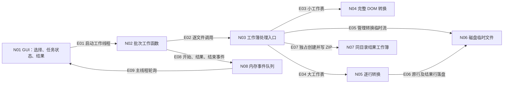

入口判断：/review

交付模式：沿用本项目 `vibe_coding` 协作背景；本次仅交付 review 和独立探针，不自动进入开发、改版本或重新发布。主通路 project，辅助 implementation。Review ID：REV-20261009-POST11。

# v1.1 发布后优化评审

对象是帮助业务人员拆开 Excel 合并单元格并填充锚点值的本地免安装工具。当前主要场景已从小报表扩展到几十万行明细；成功标准仍是结果正确、原文件及既有结果不被覆盖、长任务能完成并能找到结果。本轮从用户操作、核心性能、异常恢复、验证与维护四个维度评审。

## 基线与范围

- 仓库 HEAD / 本地 `origin/main`：`4e013c4ded2af26c6546fa16a1860fff282e5842`。这是本地引用核对，本轮没有重新联网查询远端。
- 已发布应用的源提交：`067834455de167d86351b5ab338c518744ec4afa`。当前两个产品源文件与该提交无差异。本地没有 `v1.1` tag，本次绑定提交和文件哈希，不把本地 tag 缺失当成远端发布缺失。
- 引擎 SHA256：`1d761a9f897b545c367514069e755f1aa270f1d9a777d963ffe1af41b606b5eb`；GUI SHA256：`d3a1c273f0d4bb333d26945b8b39061daa064824e413601e711aeb9ab8d2c4c0`。
- 继承 [真实月表验收](../../releases/v1.1/monthly-data-acceptance-2026-10-09/report.md) 的已发布 EXE 身份及数据正确性结果。该 104,185,338 字节输入的主表为 757,636 行 × 22 列；默认模式实际耗时 **405.875 秒，约 6 分 46 秒**，进程树峰值工作集 **295.31 MiB**。独立 XML 核对 16,667,988 个结果实体格，Excel 核对 16,667,994 个格位，均无差异。
- 上述时间是本机 EXE 批次观测，含稳定性探针；不是纯函数基准。更大的全月明细、更多列/长文本/复杂行外结构不由这个样本保证。
- 本轮应用源码只读，独立实验落在本 review 目录；合成工作簿保存在被忽略的临时目录。没有启动、关闭或操作用户正在使用的 EXE，没有重跑 104MB 全表，也没有重复原有 95 项测试与 9 项独立检查。

## 运转脉络

主图只包含已从代码确认的关系。N-ID 与 E-ID 固定用于本次评审，不代表新增设计。

| 对象 ID | 已确认职责 | 独立 locator |
|---|---|---|
| N01 | Tk 界面、当前选择和任务恢复状态 | `excel_unmerge_gui.py:100`、`:194`、`:204` |
| N02 | 固定参数副本，逐文件运行，只在文件边界检查停止 | `excel_unmerge_gui.py:81` |
| N03 | 读取 ZIP/工作表关系，分派转换，管理输出 | `excel_unmerge_fill.py:609` |
| N04 | 小工作表 DOM 变换、冲突检查、填充 | `excel_unmerge_fill.py:214` |
| N05 | 逐行落盘、活动合并区域、重放和输出 | `excel_unmerge_fill.py:343`、`:411` |
| N06 | 转换工作表及两份行 spool，随上下文关闭 | `excel_unmerge_fill.py:415`、`:629` |
| N07 | 结果自动加序号且不覆盖，源文件只读 | `excel_unmerge_fill.py:615`、`:650` |
| N08 | 工作线程与主线程之间的队列 | `excel_unmerge_gui.py:113`、`:284` |

| 关系 ID | 已确认关系 | 独立 locator |
|---|---|---|
| E01 | GUI 创建线程，传入本轮文件与选项副本 | `excel_unmerge_gui.py:269` |
| E02 | 批次调用 `process_file` | `excel_unmerge_gui.py:91` |
| E03 | 解压后工作表 XML 小于阈值时走 DOM | `excel_unmerge_fill.py:634` |
| E04 | 解压后工作表 XML ≥8 MiB 时走逐行路径 | `excel_unmerge_fill.py:630` |
| E05 | `ExitStack` 管理每张转换表临时文件 | `excel_unmerge_fill.py:629` |
| E06 | 大表内部打开原行/结果行两份临时文件 | `excel_unmerge_fill.py:415` |
| E07 | 转换完成后创建最终命名文件并分块写 ZIP | `excel_unmerge_fill.py:650`、`:663` |
| E08 | Worker 将 started/result/done 放入队列 | `excel_unmerge_gui.py:89`、`:92`、`:95`、`:97` |
| E09 | `poll_results` 在 Tk 主线程消费事件 | `excel_unmerge_gui.py:284` |

已有结构值得保留：核心引擎不依赖 GUI；工作线程不操作 Tk；非目标 ZIP 部件分块复制；大表逐行释放单元格 DOM；输出独占命名；拒绝公式/隐藏内容冲突时不生成结果。当前不需要拆成服务、引入数据库或换 GUI 框架来解决下列问题。

## 主要发现

严重度表示问题影响，不等于已批准的迭代排期。Suggestion 也可以是当前最有价值的体验改进。

| ID | 现象、影响及证据状态 | 严重度 | 最小调整或验证 | 分流 |
|---|---|---|---|---|
| R-01 | **长文件缺少内部进度和已用时。已确认。** 月表约 406 秒，文件级进度在整个转换期间都是 0/1；引擎没有阶段/行数回调。用户无法从界面判断是在解析、填充还是保存。见 `excel_unmerge_gui.py:167`、`:266`、`:291`、`:315` 及 [月表处理中截图](../../releases/v1.1/monthly-data-acceptance-2026-10-09/exe/processing.png)。符合现行 F-05，不是处理卡死的证据。 | Suggestion | 优先显示阶段、已用时和持续活动反馈；引擎可提供经过节流的行数事件。总量尚不准确时不用虚假百分比。先以慢速合成任务验证事件循环与节流，再用真实月表核对阶段。 | /idea，优先 |
| R-02 | **异常退出可能留下最终命名的半成品。已确认。** `excel_unmerge_fill.py:650–678` 直接写最终文件名，OS 终止无法运行清理。独立探针留下 45 字节的 `_2.xlsx`，重试另生成有效 `_3.xlsx`。另一个探针注入磁盘写入失败，同时持有禁止删除的外部读句柄：清理失败留下不完整工作簿，且 `PermissionError` 覆盖原始 ENOSPC。两种场景源和旧结果哈希都不变。见 [硬终止](resilience/review.md)、[文件锁旁证](quality/review.md)。 | Minor | 同目录唯一临时文件写完并关闭 ZIP 后，再不覆盖地发布正式文件；清理失败保留原始原因并提示残片路径。验证命名竞争、权限/磁盘错误及中途终止；保留原文件和已有结果。 | Bugfix 候选 |
| R-03 | **“新选择”与“上一任务恢复”容易混淆。行为已确认，误操作风险属推断。** 选择 B 后列表显示 B，“仅重试失败项”仍处理旧任务 A；日志正确记录 A。见 `excel_unmerge_gui.py:194–227`、[合成 Tk 探针](gui/probe-results.json)。符合现行任务合同，不能将其报成引擎处理错文件。 | Minor | 保留两组状态，但明确标注“待开始文件”和“上一任务”，恢复时显示实际目标/数量。用 A 失败→选 B→重试 A→启动 B 验证界面与运行目标始终可辨认。 | /idea |
| R-04 | **性能瓶颈明确，但已试微优化收益不足。已确认于合成样本。** 每行先序列化落盘，活动行再解析和序列化，见 `excel_unmerge_fill.py:386`、`:468`、`:529`。4,000 行 ×22 列、最多4个活动合并的轮换对照，首轮基线中位 1.727秒，4种微调改善仅约 −0.05%～1.89%；另一轮同基线对照中，跳过空属性映射约改善3.05%。不能据此承诺月表明显提速。见 [完整剖析与原始对照](performance/review.md)。 | Suggestion | 暂不合入这些微调；下一步若专门优化速度，应减少一次完整行解析/序列化，并先证明命名空间、空白、元数据与拒绝语义不变，再跑真实月表。 | 性能实验，分开验收 |
| R-05 | **仅凭 v1.1 标题难以辨认本地候选。已确认。** 本地两个曾显示相同标题的候选 EXE 哈希不同，Windows FileVersion/ProductVersion 为空。用户也曾多次确认本地/运行版本。见 `excel_unmerge_gui.py:24–25`、`:116`、[只读身份盘点](gui/version-copies.json)。这不说明当前运行的是旧版本。 | Suggestion | 增加“关于”：版本、构建标识、运行路径及复制诊断信息；打包补版本资源。构建标识需来自冻结源提交，不能用构建日期替代。 | /idea |
| R-06 | **多目录批次只有最近输出目录入口。已确认。** 两个目录处理均成功，日志均正确，但按钮只打开最后成功目录；见 `excel_unmerge_gui.py:323`、`:339`、[探针](gui/probe-results.json)。符合现行 F-05，数据没有丢失。 | Suggestion | 按文件展示结果路径与“打开所在文件夹”；最小变化可先把现按钮改为“打开最近结果目录”。 | /idea，后排 |
| R-07 | **PRD 当前样本说明过期。已确认。** `docs/releases/v1.1/prd_v1.1.md:93` 仍写约100MB月表未提供，后续真实验收已完成。会误导接手者重复索取/复测，但不影响程序结果。 | Minor | 在 PRD 顶部维护明确的当前状态与最新验收链接，历史追加记录保留日期；避免跨文档出现两个“当前”。 | 文档治理 |

## 意图、实现与验证对照

| 规则与意图 | 实现 / 验证 locator | 判定与本轮处置 |
|---|---|---|
| F-01/F-02：保真、保护原文件、拒绝有冲突的目标合并 | `excel_unmerge_fill.py:214`、`:411`；[已发布月表验收](../../releases/v1.1/monthly-data-acceptance-2026-10-09/report.md) 第24–27行；`tests/test_engine_regressions.py` | 已提供月表与已有回归范围内一致；不把没有证据的新文件形态自动视为通过。 |
| F-03：大表逐行及落盘，而非无限容量 | `docs/releases/v1.1/prd_v1.1.md:87–91`；`excel_unmerge_fill.py:343`、`:411`；[性能探针](performance/candidate-results.json) | 当前实现符合已批准方向；R-04 是后续机会。行索引仍随行数增长，不能表述为恒定内存。 |
| F-05：当前文件和文件级进度；最近输出目录 | `docs/releases/v1.1/prd_v1.1.md:26`；`excel_unmerge_gui.py:291`、`:323` | 一致；R-01/R-06 是新体验建议，不是旧合同漏做。 |
| F-05/F-06：当前文件安全结束后停，重试/继续沿用旧任务 | `docs/releases/v1.1/prd_v1.1.md:26–27`、`:36–44`；`tests/test_windows_gui_helpers.py:89`、`:121`；[本轮 Tk 探针](gui/probe-results.json) | 一致；R-03 是表达问题。途中立即取消、重启恢复均不在本版合同。 |
| 大文件异常时清理本次半成品、保留原/旧结果；F-04 保留原因 | `docs/releases/v1.1/prd_v1.1.md:25`、`:91`；`tests/test_engine_regressions.py:330`；[硬终止探针](resilience/hard-stop-result.json)、[文件锁探针](quality/synthetic-probe-results.json) | 普通异常已有覆盖；R-02 中 OS 强制终止是新增恢复边界；外部禁止删除的锁叠加写入失败时，清理及原因保留有局部偏离。两者都不能冒称现有停止按钮失效。 |
| F-07：版本与实际发布包对应 | [月表候选身份](../../releases/v1.1/monthly-data-acceptance-2026-10-09/candidate-identity.json)；`.github/workflows/windows-build.yml:23–31` | 继承既有发布哈希核验；R-05 是用户可见识别不足。本轮没有重新查 Release。 |
| PRD 对“当前月度验证状态”的陈述 | `docs/releases/v1.1/prd_v1.1.md:93` 与月表验收报告 | 文档过期：R-07；不是实现偏离。 |

## 需求候选池与承接

以下是 review 的候选，不是已批准 PRD。没有凭空设定“必须一分钟处理完”等业务 SLA。

| 候选 ID / 来源 | 建议顺序 | 负责人角色、输入与产物 | 最小验证 / 停止条件 / 回写 |
|---|---|---|---|
| I-01 / R-01 | 优先 | GUI+引擎维护；输入月表长等待证据；产出阶段、计时和节流进度 | 慢任务仍可响应，回调不刷爆队列，反馈与阶段一致；若只是假百分比则停止该方案；回写 F-05 与验收。 |
| I-02 / R-02 | 优先的小型可靠性补丁 | 引擎维护；输入硬终止和输出碰撞用例；产出完整结果发布流程 | 源/旧结果不变，未完整 ZIP 不用最终名字；若引入覆盖风险则不合入；回写异常合同及回归。 |
| I-03 / R-03 | 随体验修正 | GUI维护；输入 A/B 两任务操作序列；产出目标清晰的任务区 | 选择与恢复目标可区分，现有恢复语义不变；回写交互说明。 |
| I-04 / R-04 | 独立性能实验 | 引擎维护；输入剖析与真实月表；产出减少重复处理的最小原型 | 先差分和拒绝语义，再真实同文件计时/内存；若无可重复收益或内容有差异则丢弃；回写性能证据，独立可回退。 |
| I-05 / R-05 | 随下次打包 | 构建+GUI维护；输入源/制品身份；产出关于信息和版本资源 | 候选、发布包、运行路径显示一致，隐私信息不自动上传；回写发布清单。 |
| I-06 / R-06 | 后排 | GUI维护；输入跨目录两文件；产出逐文件结果入口 | 同名文件不同目录均可定位，目录已移动有提示；回写 F-05 验收。 |

R-07 可作为文档维护独立处理，无须重新构建 EXE。本次为保持 review 边界，仅记录发现，没有改写原 PRD 的历史内容。

暂不建议：为了速度立刻并行跑多个大文件（会叠加临时磁盘和内存）；整套重写引擎/更换 GUI；引入云端服务；把本轮微优化直接打包成“性能大幅提升”。中途取消与持久任务历史有额外状态和清理成本，应在用户确认频率/价值后单独收敛。

## 实际工具、复现与限制

- MyP-M-A 用于评审结构；OCR 扫描器未安装，使用本地静态审查、三路独立评审和定向探针。未将源码交给外部扫描服务。
- 读取引擎/GUI、PRD、构建工作流、测试、真实日/月表验收日志；用 `git rev-parse`、`git diff`、SHA256 绑定代码与继承证据。
- Python `cProfile` 只用来定位热点，其运行时间明显受探针扰动；性能判断来自关闭 profiler 的轮换实验。
- [性能专项](performance/review.md) 还否定了默认增加“无匹配预扫描”的取舍：合成无匹配输入约快91.5%，但常规匹配输入约慢3.68%，且未计实际 ZIP 二次解压。仅在反复提交已处理文件很频繁时才值得另评估，当前不列为优先需求。
- 自建 Tk 与合成输入验证选择/恢复、跨目录结果，打开 Explorer 的动作被替身记录；不能称为业务用户可用性测试。
- [GUI 专项](gui/review.md) 提供逐项影响推断与复现步骤。[质量专项](quality/review.md) 补充真实 Windows 文件锁的错误注入，以及自建隐藏 Excel 实例的合成样式核对；该 Excel 只读、未保存、正常退出并延后确认进程消失。
- 两项质量候选未获缺陷证据：行/列样式继承没有复现“日期变数字”；8k/16k/32k 行的格式化 XML 探针未显示失控增长。不将这些候选作为 bug，也不把小样本推广为任意大表已通过。
- 自建 Python 子进程验证 OS 强制终止边界；未真实断电，未关闭用户应用。探针源码和结果保存在 [resilience](resilience/review.md)。
- 应用源码未变化，因此既有 95 项测试、9 项独立检查和完整真实数据验收按绑定范围继承；本轮不声称又跑了一遍。没有新增可执行发布包。
- 未新增验证：更大的真实全月明细、月表全部拆分模式、WPS/干净 Windows、真实业务操作中暂停/恢复、人观察的 Excel 修复弹窗。这些是范围边界，不自动等于已发现缺陷。

## 接手摘要

1. 对象：已发布 v1.1，产品源提交 `0678344`；本轮只做 review，报告及合成证据尚未包含产品修改。
2. 事实源：本报告、各子目录探针、已发布月表验收；主仓库应用 SHA 未变。
3. 当前优先：I-01 长任务反馈、I-02 完整结果发布、I-03 恢复目标表达；R-04 微优化收益不足，不作为已实现提速。
4. 无阻塞用户继续使用已验收形态的证据；更大或不同结构工作簿仍需单独验收。
5. 下一步：从上述候选选择小范围实施；保持源/旧结果、内容语义、停止/恢复边界，并针对变化复验后再决定发布。
